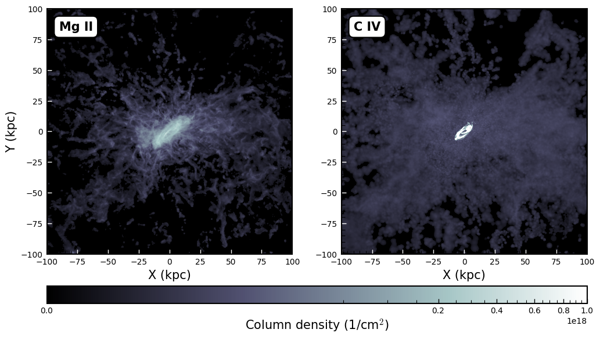

# TNG-and-TRIDENT-for-CGM-oriented-science
This repository is meant to show a set of simple experiments in order to explore the CGM of TNG galaxies.
We also include the production of mock spectra using the TRIDENT (Hummels et al. 2017) package. 

The tutorial is divided in two parts:
<<<<<<< HEAD
- TNG_galaxies_exploration.ipynb : selecting halos and subhalos, doing basic group catalogues statistics and explore individual galaxies in detail.
- TRIDENT_tutorial.ipynb : basic TRIDENT spectra generation, with a kinematical exploration of an edge-on galaxy in the end. 
    

=======
- TNG_galaxies_exploration.ipynb : selecting halos and subhalos, doing basic group catalogues statistics and explored individual galaxies in detail.
- TRIDENT_tutorial.ipynb : basic TRIDENT spectra generation, with a kinematical exploration of an edge-on galaxy in the end. 
    

>>>>>>> e042caf5bacafe11fc287cf6007f7303d02829f0
